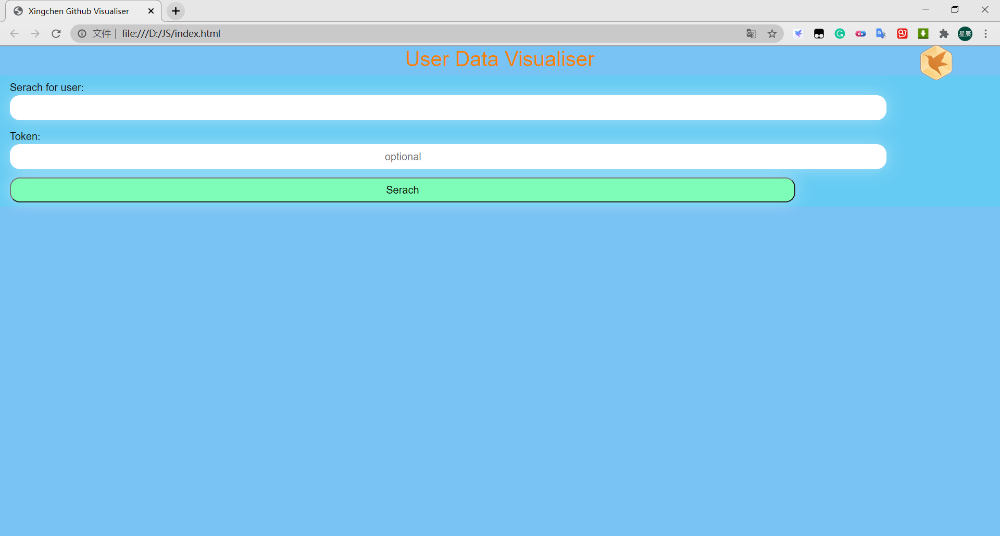
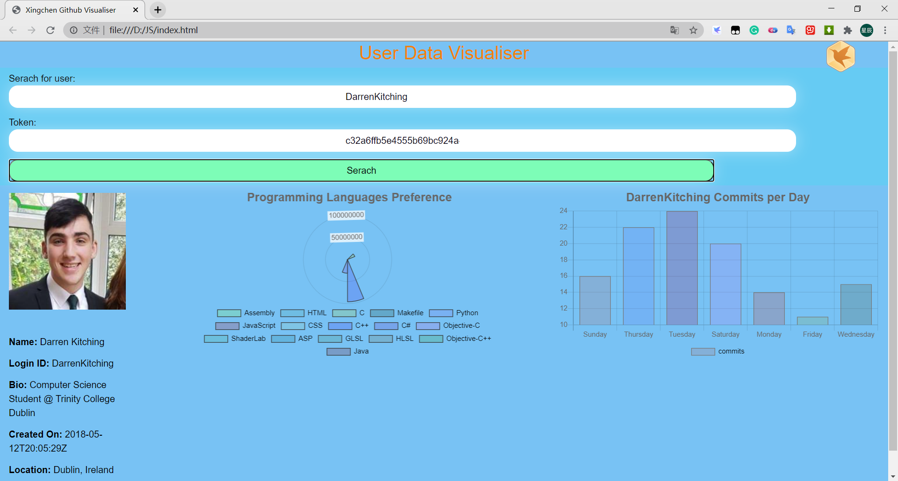
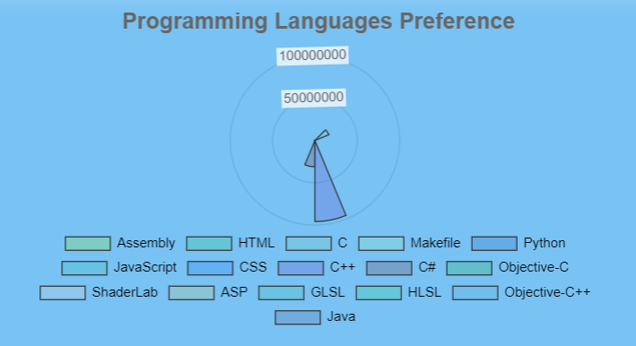
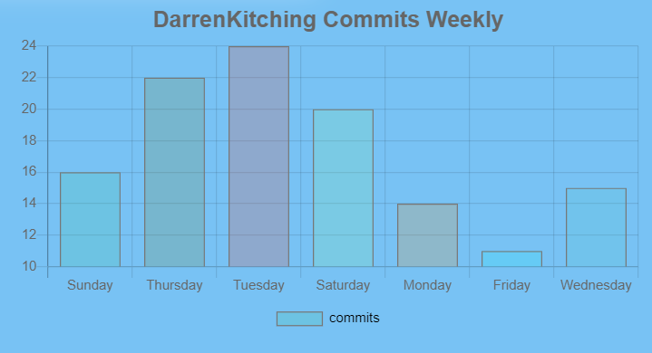

# GitHub-Visualiser

The code in this repo aims to provide more functionality to the user by providing insights into data gathered from a user.

The code runs entirely in the browser (https://yangxi628.github.io/GitHub-Visualiser/). The user can search for a particular GitHub user's statistics. To do this they simply type a username into the search bar.
  
The two aspects of measuring software engineering I focused on were:

*number of times using different language.

*the work they do over the week.

 

If the user wishes they can use an access token to allow for more requests per hour.  

Some miscellaneous user data is displayed on the left-hand side of the screen eg. username, display name, bio, etc.  

The polar area chart is showing how much user have used for each language.

the line chart is showing the commit times of 7 days of the week. So they know which day they are busy.

this was run on my personal machine which is i7-7700HQ 4 cores 2.80 GHz 8 Threads, the 5 seconds it takes to load the  graph.

